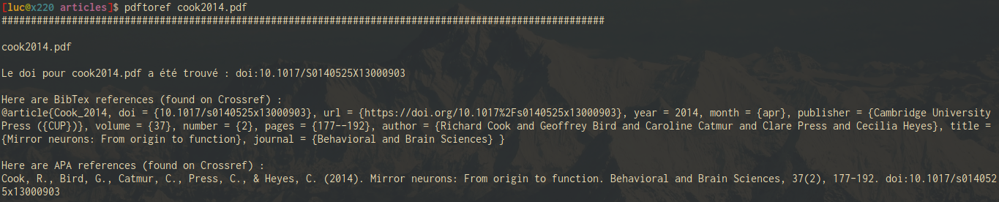

# pdftoref

`pdftoref` extracts DOIs from .pdf files, outputs and saves references (BibTex and APA formats), and organizes/classes your articles in `$HOME/articles`.

## Getting Started

### Prerequisites

`pdftoref` should work out of the box. However, you may have to install some dependencies to make it work properly :

* pdftitle (necessites python) : see https://pypi.org/project/pdftitle/
* zathura (pdf reader)

```
pip install pdftitle
sudo pacman -S zathura # or sudo apt install zathura
```

### Installing

To try `pdftoref`, you can clone this repository. For instance :

```
cd ~
git clone https://github.com/dougy147/pdftoref
```

Then, open your terminal and go to the folder you just cloned :

```
cd ~/pdftoref
```

And launch it using a pdf as first argument :

```
sh pdftoref ~/downloads/article.pdf # supposing your pdf article is in the downloads folder
```

# Examples

Here's the result on `pdftoref` with a recent article.



With the most conservative methodology, `pdftoref` is 85% accurate in finding references. It has been tested on a 155 pdf database (containing articles from year 1892 to 2019). 11 of them (7%) were mistaken with other articles. 13 of them (8%) have been found on Google Scholar only, but at the time, I have not been able to automatically extract references from a Google Scholar search in a proper manner (work in progress).
